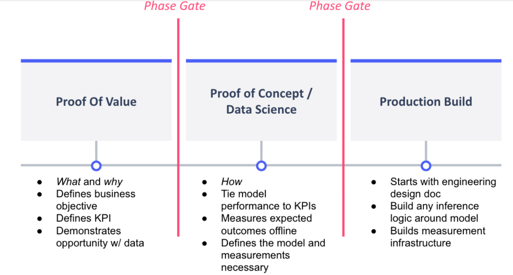

# ML Project Lifecycle

A Machine Learning project is typically split into two phases, **experimentation** & **production**. This docoument outlines the key milestones that are typically ecnountered across both of those phases of work in an end to end project delivery. 

Note: A key differentiator between ML engineering and software engineering is the dependency on data. It’s common to think of an ML model as the
output of both programming code and the data. As a result, there are more risks of things can going wrong in machine learning applications

## Phase Gate Model

In a phase gate process, a project can be terminated by the stakeholders if it is deemed infeasible, not accurate enough, or more information is needed to continue.

Thus, a project can be terminated after the proof of value exercise (if it is deemed infeasible or not worth the expenditure) or after the proof of
concept (if the data science shows the performance will not meet the need of the application).

## Phase 1: Experimentation

An iterative process that attempts to demonstrate that ML is an effective solution to a problem.

This phase is my current focus - making the tooling and processes as templatable and adhering to development best practices. 

### 1. Discovery (Proof of Value)

- Understand ROI Potential
- Understand existing business processes.
- Identify key client contacts.
- Confirm Avaliability of and access to data.
- Define clear problem statement.
- Research ML approaches to determine feasibility.

### 2. Project Setup (Proof of Concept)

- Create repository & scaffold the folder structure.
    - Leverage Kedro or other tools to support this process.
- Environment setup consideration:
    - Docker
    - Dependency management (requirements.txt, Poetry etc.)
    - Helper commands - MAKE.

### 3. Data Acquistion (Proof of Concept)

- Identify constraints on data compliance.
    - PII, GDPR etc.
- Identify data sources & access options.
- Initial review of a subset of the data.
- Create a data dictionary.
- Build data pipelines to acquire the initial dataset(s).
    - Queries, joins, scripts etc.
- Implement data versioning strategy.
    - DVC, Kedro, Sagemaker Lineage.
- Is human labelling needed?
    - SME knowledge required?
- Consider the use of a feature store
    - Sagemaker feature store (Offline in S3, or online in a low latency DB, or both.)
- Is synthetic data required?

### 4. EDA (Proof of Concept)

- Data ingestion to a notebook environment.
- Data cleaning/preprocessing
    - Missing values, outliers, data selection, normalisation etc.
- Data Analysis
    - Visualisation, correlation, distirbutions etc.
- Seasonality
- Does the training data reflect the expected real world data?
- Data Bias

### 5. Modelling (Proof of Concept)

- Target variable definition
    - binning etc.
- Handling imbalanced data/target variables.
- Feature engineering and selection
- Dimensionality reduction
- Hyperparameter optimisation
- Threshold moving
- Probability calibration
- Auto ML
    - H20, Auto SkLearn.
- Data augmentation
    - Smote, dropping majority classes etc.
- Experiment Tracking
- Model Registry
- Model types
    - Ensemble, single model, cascading models, rules based alternative?
- Repoducability of Results.

### 6. Evaluation (Proof of Concept)

- XAI
- Define a no skill model.
- Metric Selection (loss)
- Testing strategy
    - Cross validation
    - Train test split - season, account for groups.
- Confusion Matrix
- Compare to human/business process.
- Select V1 model.
- Data drift risk over time.

### 7. Solution Selection (Proof of Concept)

- Consider NFR's
- Model persistence method.
    - ONNX vs joblib.
- Recall/Precision Trade off.
- Map solution to ROI impact estimation.
- Business acceptance.
- Early indiciation of implementation effort from ML perspective.
    - Automated training required?
- Independent Review.

## Phase 2: Production

The process of converting an ML experiment into a robust solution, wrapped around supporting software to deliver business value. 

### 8. Hardening (Production Build)

- Unit tests
- Solidify documentation
- Functional, clean code.
- Logging.

### 9. Deployment Plan (Production Build)

- Establish multi skilled team
- Design solution architecture
    - Batch vs realtime inference.  
    - Model management strategy
    - A/B testing required?
    - Human in the loop?
    - Who/what is impacted by introducing this solution?
- Formal estimation
- Cost of solution

### 10. Solution Build (Production Build)

- Observability
    - Datadog
- Data drift monitoring.
- ML solution optimisation.
- CI Processes - Model generation + code artifacts
- Code Packaging
    - Docker, Poetry, Lambda Zip.
- Infrastructure as code needs.
- Define SLA's
- Auto scaling
- Alerts
- Compute - Power and type (AKS versus app service etc).
- Security - security groups, IP/port access, bastion, access policies to machines
- Networking - virtual networks / VPC, IP/port access
- Web app - load balancers & application gateways (web application firewall), health checks
- Avaliability zones/regions and redundancy
- Infrastructure as code (ARM, Terraform or other).
- Backups
- Disaster recovery

## Resources

Information supported by ML-Ops principles:
- https://ml-ops.org/content/state-of-mlops
- https://towardsdatascience.com/mlops-at-home-part1-4c60db29d4a2
- https://cloud.google.com/architecture/mlops-continuous-delivery-and-automation-pipelines-in-machine-learning
